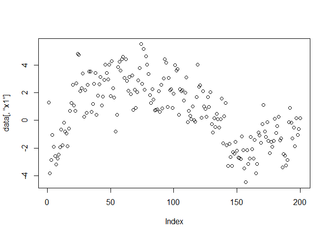
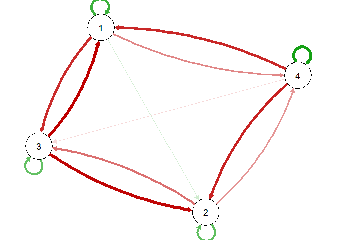
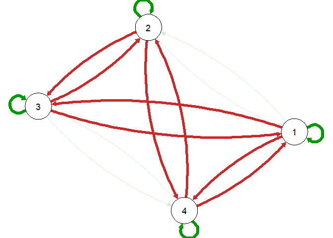
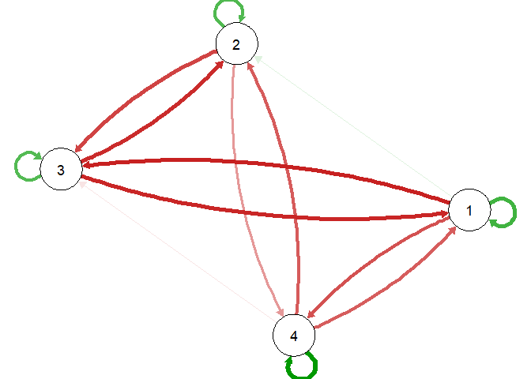

<!-- README.md is generated from README.Rmd. Please edit that file -->

# quadVAR

<!-- badges: start -->

[](https://CRAN.R-project.org/package=quadVAR)
<!-- badges: end -->

Estimate quadratic vector autoregression models with the strong
hierarchy using the RAMP algorithm, compare the performance with linear
models, and construct networks with partial derivations.

## Installation

You can install the development version of quadVAR from
[GitHub](https://github.com/) with:

``` r
# install.packages("devtools")
devtools::install_github("Sciurus365/quadVAR")
```

## Example

``` r
library(quadVAR)
set.seed(1614)
data <- sim_4_emo(time = 200, sd = 1)
plot(data[,"x1"])
```



``` r
qV1 <- quadVAR(data, vars = c("x1", "x2", "x3", "x4"))
summary(qV1)
#> # A tibble: 5 × 5
#>   Model        Sumdf SumIC DiffIC   Weight
#>   <chr>        <dbl> <dbl>  <dbl>    <dbl>
#> 1 AR               4 2829.  369.  6.83e-81
#> 2 VAR             16 2567.  107.  5.64e-24
#> 3 VAR_full        16 2567.  107.  5.65e-24
#> 4 quadVAR         27 2460.    0   1.00e+ 0
#> 5 quadVAR_full    56 2526.   65.9 4.79e-15
coef(qV1)
#>    model effect estimate
#> 1      1     X1     0.35
#> 2      1     X2     0.00
#> 3      1     X3    -0.39
#> 4      1     X4    -0.29
#> 5      1   X1X1    -0.09
#> 6      1   X1X2     0.00
#> 7      1   X1X3    -0.09
#> 8      1   X1X4    -0.10
#> 9      1   X2X2     0.00
#> 10     1   X2X3     0.00
#> 11     1   X2X4     0.00
#> 12     1   X3X3     0.00
#> 13     1   X3X4     0.00
#> 14     1   X4X4     0.02
#> 15     2     X1     0.06
#> 16     2     X2     0.32
#> 17     2     X3    -0.38
#> 18     2     X4    -0.30
#> 19     2   X1X1     0.00
#> 20     2   X1X2     0.00
#> 21     2   X1X3    -0.05
#> 22     2   X1X4     0.00
#> 23     2   X2X2    -0.07
#> 24     2   X2X3    -0.03
#> 25     2   X2X4    -0.11
#> 26     2   X3X3     0.00
#> 27     2   X3X4     0.00
#> 28     2   X4X4     0.00
#> 29     3     X1    -0.40
#> 30     3     X2    -0.34
#> 31     3     X3     0.31
#> 32     3     X4    -0.05
#> 33     3   X1X1     0.00
#> 34     3   X1X2     0.00
#> 35     3   X1X3    -0.06
#> 36     3   X1X4     0.00
#> 37     3   X2X2     0.04
#> 38     3   X2X3     0.00
#> 39     3   X2X4    -0.02
#> 40     3   X3X3     0.00
#> 41     3   X3X4     0.00
#> 42     3   X4X4     0.00
#> 43     4     X1    -0.31
#> 44     4     X2    -0.19
#> 45     4     X3     0.00
#> 46     4     X4     0.46
#> 47     4   X1X1     0.00
#> 48     4   X1X2     0.00
#> 49     4   X1X3     0.00
#> 50     4   X1X4    -0.16
#> 51     4   X2X2     0.00
#> 52     4   X2X3     0.00
#> 53     4   X2X4     0.00
#> 54     4   X3X3     0.00
#> 55     4   X3X4     0.00
#> 56     4   X4X4    -0.04
plot(qV1)
#> ℹ The quadVAR model, being nonlinear, generates a network meaningful only for
#>   specific variable values. If values are unspecified, the plot defaults to the
#>   mean, but this may not be meaningful in all cases.
#> This message is displayed once every 8 hours.
```



``` r
# Compare the estimation with the true model
plot(true_model_4_emo())
```



``` r
plot(qV1, value = 0, value_standardized = FALSE, layout = plot(true_model_4_emo())$layout)
```


